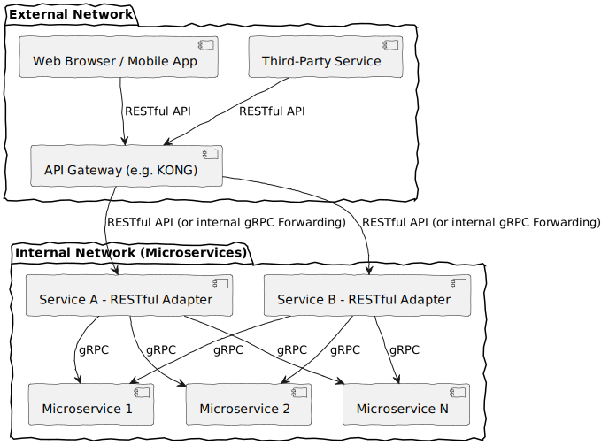
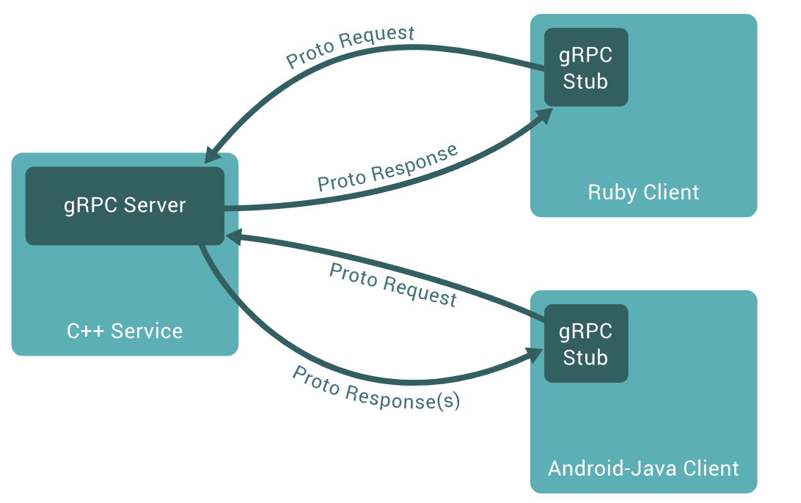

# Concluding First (先说结论)

In **real-world projects** (specifically those using a **microservice architecture**), we typically use **gRPC** for communication within our internal network and cloud infrastructure, while exposing a **RESTful API** to our front-end website and external customers.

***

# Background

Since around 2021, the projects I've been involved with began adopting gRPC instead of relying solely on RESTful APIs. I remember being initially confused by this "new" method of calling our Java, Python, and Node APIs, especially that it was built on top of **HTTP/2**.

Early in 2025, due to the challenging economy, I had to look for a new job. During one interview, I was asked, **"Tell me the difference between gRPC and a RESTful API and why your team used it."** While I wasn't the one who decided to adopt this technology, the fact was I didn't have a crystal-clear understanding of the differences or the full rationale. I felt like a mere worker who just knew *how* to build the product, but not *why*—a feeling I wouldn't recommend.

So, let's start with the definitions...

***

# What Are RPC, gRPC, and RESTful API?

## Remote Procedure Call (RPC) 💻

**RPC**, or **Remote Procedure Call**, is a communication protocol that allows a program on one computer to execute a function or procedure on another computer as if it were a local call. The programmer doesn't need to explicitly code the complex details of the remote interaction, such as handling network connections or serializing/deserializing data (marshalling/unmarshalling).

Think of it like calling a function from a local code library. With RPC, that "library" just happens to be running on a different machine across a network. The goal is to make distributed computing feel like local computing.

## gRPC (gRPC Remote Procedure Call) 🚀

**gRPC** (gRPC Remote Procedure Call) is a modern, high-performance, open-source RPC framework developed by Google. It's essentially a supercharged version of the traditional RPC concept.

Its key features are:

* **Protocol Buffers (Protobuf):** Instead of using human-readable text like JSON, gRPC uses **Protobuf** to serialize structured data. Protobuf is a **binary format**, which makes the resulting payload much **smaller** and **faster to parse**.
* **HTTP/2:** gRPC is built on top of **HTTP/2**, enabling advanced features like **multiplexing** (sending multiple requests concurrently over a single TCP connection), **server push**, and **bidirectional streaming**.
* **Strongly Typed Contracts:** You define your API services and message structures in a `.proto` file. This file acts as a strict, language-agnostic **contract** between the client and server, facilitating code generation for different languages and significantly reducing integration errors.

## RESTful API (Representational State Transfer) 🌐

**REST** stands for **Representational State Transfer**. It is not a protocol but an **architectural style** for designing networked applications. A web service that adheres to this style is called a RESTful API.

It's based on a few core principles:

* **Resource-Oriented:** Everything is treated as a "resource" (e.g., a user, a product, an order), identified by a unique URL (e.g., `/users/123`).
* **Stateless:** Each request from a client to a server must contain all the information needed to understand and complete it. The server does not store any client-specific context between requests.
* **Standard HTTP Methods:** It leverages standard HTTP verbs to define actions on resources:
    * `GET`: Retrieve a resource.
    * `POST`: Create a new resource.
    * `PUT`/`PATCH`: Update an existing resource.
    * `DELETE`: Remove a resource.
* **Data Format:** It most commonly uses **JSON** for data transmission, which is lightweight and inherently human-readable.

***

# The Differences: gRPC vs. RESTful API

## RPC vs. gRPC: The Implementation Difference

Comparing RPC and gRPC is a bit like comparing the general concept of a "car" to a "Tesla." **gRPC is a specific, modern, and highly optimized implementation of the general RPC concept.** While traditional RPC systems (like XML-RPC or JSON-RPC) exist, gRPC has become the modern standard due to its superior performance and features.

| Feature | Traditional RPC (e.g., JSON-RPC) | gRPC |
| :--- | :--- | :--- |
| **Data Format** | JSON, XML (Text-based) | **Protocol Buffers** (Binary) |
| **Transport** | Typically HTTP/1.1 | **HTTP/2** |
| **Performance** | Slower due to text parsing | **Very High** (Binary format & HTTP/2) |
| **Contract** | Loosely defined | **Strictly defined** in `.proto` files |
| **Streaming** | Not natively supported | **Built-in** bidirectional streaming |

## gRPC vs. RESTful API: The Core Philosophies

This is the most critical comparison when designing APIs for a microservices environment. They follow fundamentally different philosophies: gRPC is **procedure-oriented**, while REST is **resource-oriented**.

| Aspect | gRPC (Procedure-Oriented) | REST (Resource-Oriented) |
| :--- | :--- | :--- |
| **Paradigm** | **Actions/Functions** (e.g., `CreateUser(user)`) | **Nouns/Resources** (e.g., `POST /users`) |
| **Data Format** | Protocol Buffers (Binary, efficient) | JSON (Text, human-readable) |
| **Performance** | 🚀 **Highest.** Faster serialization, smaller payloads, HTTP/2. | ✅ **Good.** Simpler and widely supported. |
| **Coupling** | **Tightly coupled.** Client/server share the `.proto` contract. | **Loosely coupled.** Can be called with any simple HTTP client. |
| **Streaming** | Native bidirectional streaming support. | No native support; requires WebSockets or long polling. |
| **Browser Support** | Requires a proxy layer (gRPC-Web) for direct browser calls. | ✅ Works **out-of-the-box** in all browsers. |
| **Use Case** | **Internal Microservice Communication**, Mobile/IoT clients. | **Public-facing APIs**, Web clients, Simple services. |

***

## Pros & Cons: When to Choose Which

The choice depends entirely on the **context** of the communication:

### Choose gRPC when:

* ✅ **Performance is paramount**, particularly for latency and throughput.
* ✅ You have a complex **microservices architecture** requiring efficient internal communication.
* ✅ You need advanced features like **bidirectional streaming** (e.g., for live updates).
* ✅ A strict, **type-safe API contract** across multiple languages is essential.

### Choose REST when:

* ✅ **Simplicity and human-readability** of the API and its payloads are key.
* ✅ The API needs to be consumed **directly by browsers** without a proxy layer.
* ✅ The API is **public-facing** and requires maximum compatibility with external clients.
* ✅ You need to leverage **HTTP caching mechanisms**.

**A quick note:** While most web traffic still relies heavily on HTTP/1.1 and HTTP/2, the adoption of HTTP/3 is increasing. HTTP/3 offers further advantages over HTTP/2, but exploring that is beyond the scope of this post.

***

# DEMO and Resources for Deeper Learning

When I first considered writing this post, I planned to create a demo Node.js project to demonstrate gRPC usage, as I can't share my company's internal code publicly. However, I found that the official gRPC team has already shared excellent, high-quality examples.

Therefore, I recommend diving straight into the official resources, specifically the **Node.js Demo**: ["gRPC - Node Demo"](https://github.com/grpc/grpc-node). I missed this valuable resource for many years because I initially learned gRPC using internal company materials and projects. Don't make the same mistake!
